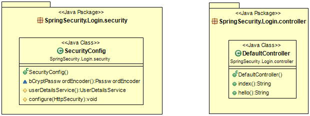

# 1. 개요
* 메모리 계정의 로그인 인증
> 계정이 DB로 관리되지 않고 인메모리(InMemory)로 관리

<br>

# 2. 요구사항
* hello페이지 접근 시 인증 불필요
* 이외의 페이지는 인증 요구
* testA계정을 생성하고 메모리로 관리

<br>

# 3. UML
* Controller,SpringSecurity 패키지로 구성


<br>

# 4. 구현
## 4.1 인증
* /hello이외의 다른 접근은 인증 요구
```java
; SecurityConfig.class

@Override
    protected void configure(HttpSecurity http) throws Exception {
        http
                .csrf().disable()
                .authorizeRequests()
                    .antMatchers("/hello").permitAll()
                    .anyRequest().authenticated()
                .and()
                .httpBasic();
    }
``` 

## 4.2 계정 생성 
* 인메모리 계정 생성(계정:testA, 비밀번호: password)
```java
; SecurityConfig.class

@Bean
PasswordEncoder bCryptPasswordEncoder(){
    return new BCryptPasswordEncoder(10);
}

@Override
@Bean
protected UserDetailsService userDetailsService() {
    UserDetails user_testA = User.builder()
            .username("testA")
            .password(bCryptPasswordEncoder().encode("password"))
            .roles("TEST")
            .build();

    return new InMemoryUserDetailsManager(
            user_testA
    );
}
```

<br>

# 5. 참고자료
* [1] SpringSecurity InMemory 공식문서: https://docs.spring.io/spring-security/site/docs/5.4.1/reference/html5/#servlet-authentication-inmemory
* [2] 영상: https://www.youtube.com/watch?v=her_7pa0vrg
